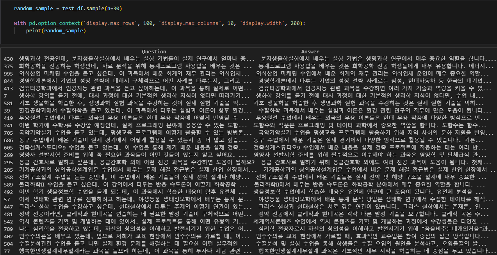
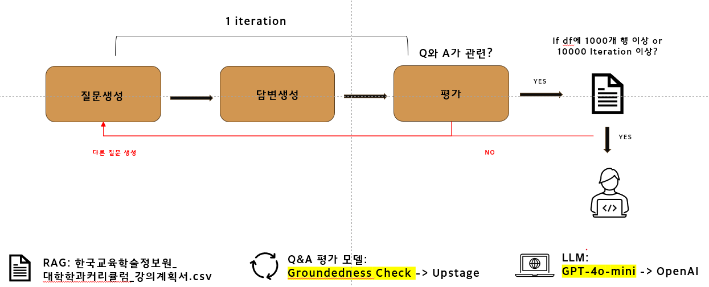

# 대학 강의 Q&A 생성기

## 📚 프로젝트 소개

이 프로젝트는 대학 강의 계획서 파일을 기반으로 학생들이 할 만한 질문과 그에 대한 답변을 자동으로 생성하는 시스템입니다. '한국교육학술정보원_대학학과커리큘럼_강의계획서'를 토대로 정확하고 다양한 Q&A를 자동으로 생성하고 Llama 3.1 모델을 학습시키는 것이 주된 목표였습니다.

---

## 📊 프로젝트 구조

- 이 프로젝트는 LangGraph를 사용하여 다음과 같은 워크플로우로 구성되어 있습니다.

1. **질문 생성 (generate_question)**: 
   - 랜덤하게 선택된 강의 컨텍스트를 기반으로 다양한 학문 분야와 카테고리에 대한 질문을 생성합니다.

2. **답변 생성 (answer_question)**:
   - 생성된 질문에 대해 주어진 컨텍스트를 바탕으로 답변을 생성합니다.

3. **Groundedness 체크 (check_groundedness)**:
   - Upstage API를 사용하여 생성된 답변의 관련성을 검증합니다.
   - 관련성이 없을시 1번으로 가서 질문을 다시 생성합니다.

4. **데이터프레임 업데이트 (update_dataframe)**:
   - 관련성이 있다고 판단된 Q&A 쌍을 데이터프레임에 추가합니다.

5. **반복 또는 종료 결정 (should_continue)**:
   - 설정된 조건에 따라 반복할지 종료할지 결정합니다.

---

## 🌟 주요 기능

- 다양한 학문 분야와 6가지 카테고리에 걸친 질문 무작위 생성
- 무작위로 생성된 질문에 대한 관련성 있는 답변 제공 
- 질문과 답변의 관련성 검증 (Groundedness Check) 
- 조건부 엣지를 추가해서 관련없는 답변이면 질문 생성 노드로 이동 
- 관련있는 답변이면 데이터프레임에 추가
- 1000개의 QnA 쌍이 만들어지면 결과를 CSV 파일로 저장

---

## 🛠 기술 스택

- **Python**: 주 프로그래밍 언어
- **Pandas**: 데이터 처리 및 분석
- **KoNLPy (Okt)**: 한국어 자연어 처리
- **SentenceTransformer**: 텍스트 임베딩
- **OpenAI API (chatgpt-4o-mini)**: 질문 및 답변 생성
- **Upstage API (Groundedness Check)**: Groundedness 체크
- **LangGraph**: 그래프 생성 및 조건부 노드 생성

---

## 💡 핵심 기술 설명

1. **한국어 전처리 (KoNLPy Okt)**
   - 'Okt'를 사용하여 한국어 텍스트에서 명사와 구문을 추출합니다.
   - 이는 텍스트의 핵심 의미를 보존하면서 노이즈를 줄이는 데 도움을 줍니다.

2. **텍스트 임베딩 (SentenceTransformer)**
   - 'distiluse-base-multilingual-cased-v2' 모델을 사용합니다.
   - 이 모델은 다국어를 지원하며, 특히 한국어 텍스트에 대해 좋은 성능을 보입니다.
   - BERT 모델보다 약 40% 정도 파라미터가 적기 때문에 메모리 사용량과 연산량이 줄어들어 더 빠르게 실행됩니다. 그래서 실시간 애플리케이션이나 자원이 제한된 환경에서 유용합니다.
   - 텍스트를 고차원 벡터 공간으로 변환하여 의미적 유사성을 계산할 수 있게 합니다.

3. **데이터 직렬화 (Pickle)**
   - 전처리된 데이터와 임베딩을 파일로 저장하고 로드하는 데 사용됩니다.
   - 이를 통해 시스템의 초기화 시간을 크게 단축할 수 있습니다.

4. **답변 적절성 검증 (Upstage Groundedness Check)**
    - 생성된 답변이 제공된 맥락에 기반한 적절한 답변인지 확인합니다.
    - 'Chatgpt-4o-mini'가 생성한 응답의 신뢰성을 평가하여, 맥락에 맞지 않는 답변을 필터링하고 적절한 정보만 사용자에게 제공할 수 있습니다.

5. **워크플로우 관리 및 실행 (LangGraph)**
    - 질문 생성, 답변 생성, 검증 및 데이터 저장을 포함하는 전체 워크플로우를 관리합니다.
    - 각 단계의 노드와 이들 간의 흐름을 정의하여, 복잡한 작업을 체계적으로 관리하고, 다양한 조건에 따른 분기 처리를 쉽게 구현할 수 있습니다.

6. **랜덤 선택 및 다양성 확보 (Random)**
    - Python의 random 모듈을 사용하여 데이터프레임에서 1~3개의 랜덤한 행을 선택합니다.
    - 랜덤한 선택은 질문 생성 과정에서 다양성을 확보하고 더 풍부한 데이터셋을 만들 수 있습니다. 다양한 맥락에서 생성된 질문들은 데이터의 일반화 가능성을 높이고 더 많은 시나리오에 대응할 수 있을 것입니다.

---

## 💡 프롬프트 엔지니어링 기술

1. **Role Prompting (역할 지시 프롬프트)**

    - 설명: AI에게 특정 역할을 부여하여 그 역할에 맞는 응답을 생성하도록 유도하는 기술입니다.
    - 적용 예시: "당신은 대학 강의에 대해 학생들이 할 법한 질문을 생성하는 AI 에이전트입니다."라는 문구에서 AI에게 '대학 강의에 대해 질문을 생성하는 AI 에이전트'라는 역할을 부여하고 있습니다. 이를 통해 AI는 명확한 컨텍스트 내에서 작업을 수행하게 됩니다.

2. **Few-shot Prompting (소수 샷 프롬프트)**

    - 설명: AI 모델에게 몇 가지 예시를 제공하여 모델이 특정 작업을 수행하는 방법을 학습하도록 돕는 기술입니다. 예시를 통해 AI는 기대되는 출력의 형식과 내용을 더 잘 이해하게 됩니다.
    - 적용 예시: 프롬프트에 포함된 예시 질문들(예: "통계학과에서 통계수학 1을 안 듣고 통계수학 2부터 들어도 될까요?")은 few-shot prompting의 한 예입니다. 이러한 예시들은 AI가 생성해야 할 질문의 형식과 스타일을 명확히 보여줍니다.

3. **Instruction Prompting (지시문 프롬프트)**

    - 설명: AI에게 명확한 지침과 단계를 제공하여 모델이 특정한 방식으로 응답하도록 유도하는 기술입니다.
    - 적용 예시: 프롬프트 내의 "‘카테고리’와 ‘학문 분야’에서 각각 하나를 무작위로 선택하세요. 그리고 ‘주의사항’을 참고하고 포함될 맥락(context_text)을 고려해서 하나의 질문만을 생성해주세요."와 같은 지시문은 AI가 수행해야 할 작업을 명확하게 제시합니다.

4. **Contextual Prompting (맥락 기반 프롬프트)**

    - 설명: AI 모델이 응답을 생성할 때 특정한 맥락을 고려하도록 유도하는 기술입니다.
    - 적용 예시: 프롬프트의 {context_text} 부분은 AI에게 질문을 생성할 때 참조할 맥락을 제공합니다. 이는 AI가 더 관련성 높은 질문을 생성할 수 있도록 돕습니다.

5. **Randomization (무작위화)**

    - 설명: 프롬프트 내에서 선택의 무작위성을 도입하여 AI가 더 다양한 결과를 생성하도록 유도하는 기술입니다.
    - 적용 예시: "‘카테고리’와 ‘학문 분야’에서 각각 하나를 무작위로 선택하세요."라는 지시는 AI가 특정한 범주와 학문 분야를 무작위로 선택하여 질문을 생성하도록 합니다. 이를 통해 생성되는 질문의 다양성을 높일 수 있습니다.

6. **Negative Prompting (부정적 지시 프롬프트)**

    - 설명: AI에게 피해야 할 요소를 명확히 지시함으로써 원치 않는 결과를 줄이는 기술입니다.
    - 적용 예: "‘카테고리’와 ‘학문 분야’가 드러나지 않도록 합니다."와 같은 지시문은 AI가 질문을 생성할 때 특정 정보가 노출되지 않도록 조정합니다.

---

## 🚀 사용 방법

1. 저장소를 클론합니다.
2. 필요한 패키지는 설치합니다.
3. `Embedding.py`를 실행시키고 `processed_df.pkl`, `embeddings.pkl` 파일이 같은 폴더에 있는지 확인합니다.
4. `.env` 파일을 생성하고 API 키를 설정합니다.
5. `main.py` 실행
6. `course_qa_results.csv` 파일이 생성되며 실행이 종료됩니다.

---

## 🔧 커스터마이징

- `generate_question` 함수의 프롬프트를 수정하여 질문의 스타일과 내용을 조정할 수 있습니다.
- `answer_question` 함수의 프롬프트를 변경하여 답변의 형식과 깊이를 조절할 수 있습니다.
- `should_continue` 함수에서 반복 횟수와 생성할 Q&A 쌍의 수를 조정할 수 있습니다.

---

## 느낀점 및 향후 개선 방향

1. **오픈소스 모델 활용**: 현재의 뛰어난 모델 조합으로 고품질 출력물을 생성한 후, 이를 바탕으로 Open Source Llama 3.1 버전을 학습시키는 방안을 고려해볼 수 있습니다. 이는 API 비용 절감과 효율적인 서비스 제공을 가능하게 할 것입니다.

2. **다양성 증대**: `context_text`에서 랜덤하게 열을 선택하여 질문을 생성하면 더욱 다양한 질문(학기, 년도, 학교 등)을 얻을 수 있을 것으로 예상됩니다.

3. **중간 결과 저장**: 중간 결과를 저장하는 메커니즘을 추가하는 것습니다. 대용량으로 파일을 구축할 시 에러가 발생할 수도 있기 때문입니다. 예를 들어, 100개마다 중간 결과를 파일로 저장하는 등의 방법을 고려할 수 있을 것 같습니다.

4. **임베딩 모델 성능 향상**: 현재 사용 중인 임베딩 모델로도 성능이 좋았지만 더 나은 결과를 위해 다음 모델을 고려해볼 수 있습니다:

   Upstage 사의 `Solar-embedding-1-large` 모델 (2023.08.28 기준 한국어 임베딩 모델 중 최고 성능)

이러한 개선을 통해 더욱 효과적이고 다양한 Q&A AI 에이전트 시스템을 구축할 수 있을 것으로 기대됩니다.

---

## 🤝 기여하기

프로젝트에 기여하고 싶으시다면 언제든지 Pull Request를 보내주세요. 큰 변경사항의 경우, 먼저 이슈를 열어 논의해 주시기 바랍니다.

---

## 📬 연락처

질문이나 피드백이 있으시면 [lht92229@gmail.com](mailto:lht92229@gmail.com)로 연락 주세요.
